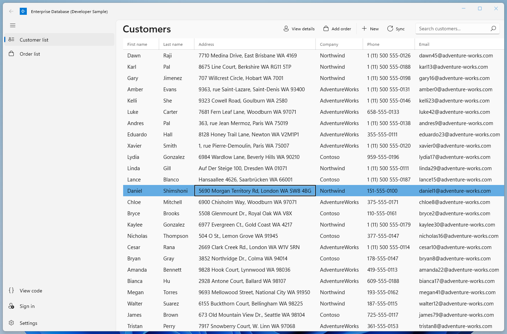

<!---
  category: ControlsLayoutAndText Data IdentitySecurityAndEncryption Navigation NetworkingAndWebServices
-->

# Customers Orders Database sample

A WinUI 3 sample app that showcases UI controls (including a data grid) and the latest design guidance for apps on Windows 11. It also demonstrates features useful to enterprise developers, like Azure Active Directory (AAD) authentication, Entity Framework, and cloud API services. The sample is based around creating and managing customer accounts, orders, and products for the fictitious company Snp.

> Note - This sample is targeted and tested for Windows 11 Insider Preview using the Insider Preview SDK Build 22000, and Visual Studio 2022 version 17.1 or later. If you are developing on Windows 10, retarget the SnpApp project to Windows 10, version 2004 (10.0; Build 19041).

## May 2022 update

This update includes:

* Updated Plaform
  * [WinUI](https://docs.microsoft.com/windows/apps/winui) 2.6.1 to 3.

* Updated Target framework
  * .NET 6

* Added new NuGet packages and/or libraries

* Updated NuGet packages
  * [Windows Community Toolkit](https://devblogs.microsoft.com/ifdef-windows/windows-community-toolkit-for-project-reunion-0-5/) 7.0.2 to 7.1.2 that supports the 1.0 version of the Windows App SDK which is required for WinUI 3.

* Improvements:
  * Remove the native Universal Windows Platform (UWP) [AccountsSettingsPane](https://docs.microsoft.com/en-us/windows/uwp/security/web-account-manager) in favor of start using Microsoft Identity Client directly avoiding the usage of [interop](https://docs.microsoft.com/en-us/windows/win32/api/accountssettingspaneinterop/nn-accountssettingspaneinterop-iaccountssettingspaneinterop). More information about the current support of [Web Account Manager in WinUI 3](https://github.com/microsoft/WindowsAppSDK/issues/398#issuecomment-777762616) and [WebAuthenticationBroker for Reunion](https://github.com/microsoft/WindowsAppSDK/issues/441).
  * Implements recommended [token Caching approach for Desktop apps](https://github.com/MicrosoftDocs/azure-docs/blob/354cfcef85fa080c1e07477fa009a8125479ee1d/articles/active-directory/develop/msal-net-token-cache-serialization.md#desktop-apps) and now you can close the app and next time you sign-in if token has not expired it is acquired silently. 
  * Implements Signout flow by deleting cached tokens.

## Previous updates

## August 2021 update

This update includes:

* Updated NuGet packages
  * [WinUI](https://docs.microsoft.com/windows/apps/winui/winui2/getting-started) 2.4 to 2.6.1
  * [Windows Community Toolkit](https://docs.microsoft.com/windows/communitytoolkit/getting-started) 4.0 to 7.0.2
  * Replace Toolkit Expander control with [WinUI Expander](https://docs.microsoft.com/windows/apps/design/controls/expander) control, remove Toolkit UI Controls package
* Update UI to follow the latest [Windows 11 design principles](https://docs.microsoft.com/windows/apps/design/signature-experiences/design-principles).
* Bug fixes and enhancements

To see how we updated the UI to look at home on Windows 11, see [Updating the Customers Orders Database sample UI to Windows 11].

### June 2020 update

This update includes:

* Update to WinUI 2.4
  * Add Microsoft.UI.Xaml NuGet package reference
  * Update <Application.Resources> in App.xaml
* Refactoring for the following WinUI 2.4 controls:
  * [ProgressBar](https://docs.microsoft.com/windows/uwp/design/controls-and-patterns/progress-controls)
  * [NavigationView](https://docs.microsoft.com/windows/uwp/design/controls-and-patterns/navigationview)
  * [RadioButtons](https://docs.microsoft.com/windows/uwp/design/controls-and-patterns/radio-button)

### Older

* Use of new controls like [DataGrid](https://docs.microsoft.com/windows/communitytoolkit/controls/datagrid),
[NavigationView](https://docs.microsoft.com/uwp/api/windows.ui.xaml.controls.navigationview), and
[Expander](https://docs.microsoft.com/windows/communitytoolkit/controls/expander).
* Code quality improvements.

## Features

This sample highlights:

* The list/details UI pattern
* An editable DataGrid control
* Form layouts
* Authenticating and obtaining user info using Azure Active Directory (AAD)
* Connecting to an external web API built with ASP.NET Core 6.0.

This sample is designed to cover the core scenarios with minimal architectural complexity. For a more complex, full-featured sample that covers many of the same scenarios using a more sophisticated architecture, see the [VanArsdel Inventory sample](https://github.com/Microsoft/InventorySample).

## Run the sample

This sample is designed to connect to an instance of Azure Active Directory for authentication and an external service for data.
To get you started right away, we've provided some demo data and a test service you can connect to.
However, in order to debug and explore the full functionality of the app, you'll need to deploy your own instance to Azure.

### Quick start

#### Prepare your environment

* Windows
  * Windows 11 Insider Preview (Build 22000).
   OR
  * Windows 10. Minimum: Windows 10, version 2004 (10.0; Build 19041).
* [.NET 6.0 SDK](https://www.microsoft.com/net/core).
* [Visual Studio 2022 version 17.1 or later](https://visualstudio.microsoft.com/downloads/). You can use the free Visual Studio Community Edition to build and run WinUI 3 apps.
* [Windows App SDK 1.0](https://docs.microsoft.com/windows/apps/windows-app-sdk/set-up-your-development-environment?tabs=vs-2022-17-1-a%2Cvs-2022-17-1-b#required-workloads-and-components).

To get the latest updates to Windows and the development tools, and to help shape their development, join
the [Windows Insider Program](https://insider.windows.com).

#### Run

Set your startup project as **Snp.App**, the architecture to x86 or x64, and press F5 to run.

#### Complete setup

To fully explore the sample, you'll need to connect to your own Azure Active Directory and data source. Values you need to fill
are in [Constants.cs](SnpRepository/Constants.cs).

* **Deskptop app Client Id**: Set the *AccountClientId* field to your Azure account client Id.
* **API endpoint**: Set the value of the *BaseUrl* constant to match the url the backing service is running on.
* **Set a database connection string**: Set the connection string to one of your own local or remote databases.
* **Associate this sample with the Store**: Authentication requires store association. To associate the app with the Store,
right click the project in Visual Studio and select **Store** -> *Associate App with the Store*. Then follow the instructions in the wizard.

## Run

You can then either start the service running locally, or deploy it to Azure.

### Register the Azure Active Directory app (Web api)

First, complete the steps in [Register an application with the Microsoft identity platform](https://docs.microsoft.com/azure/active-directory/develop/quickstart-register-app) to register the web application.

| App registration   setting | Value for this sample app                                                                                                                                                                                                                                                                                                                                                                         | Notes                                                                                                       |
|-------------------------------:|:--------------------------------------------------------------------------------------------------------------------------------------------------------------------------------------------------------------------------------------------------------------------------------------------------------------------------------------------------------------------------------------------------|:------------------------------------------------------------------------------------------------------------|
|                       **Name** | `active-directory-snp-customer-oders-protected-api`                                                                                                                                                                                                                                                                                                                                           | Suggested value for this sample.   You can change the app name at any time.                             |
|    **Supported account types** | **Accounts in this organizational directory only (Any Azure AD directory - Multitenant)**                                                                                                                                                                                                                                                                                                         | Required for this sample.   Support for the Single tenant.                                              |
|              **Expose an API** | **Scope name**: `Snp.ReadWrite` **Who can consent?**: **Admins and users** **Admin consent display name**: `Act on behalf of the user` **Admin consent description**: `Allows the API to act on behalf of the user.` **User consent display name**: `Act on your behalf` **User consent description**: `Allows the API to act on your behalf.` **State**: **Enabled** | Add a new scope that reads as follows `api://{clientId}/Snp.ReadWrite`. Required value for this sample. |

### Register the Azure Active Directory app (Client desktop app)

Then, complete the steps in [Register an application with the Microsoft identity platform](https://docs.microsoft.com/azure/active-directory/develop/quickstart-register-app) to register the deskptop application.

| App registration   setting | Value for this sample app                                                           | Notes                                                                                                          |
|-------------------------------:|:------------------------------------------------------------------------------------|:---------------------------------------------------------------------------------------------------------------|
|                       **Name** | `active-directory-snp-customer-oders-winui3`                                    | Suggested value for this sample.   You can change the app name at any time.                                |
|    **Supported account types** | **Accounts in any organizational directory (Any Azure AD directory - Multitenant)** | Suggested value for this sample.                                                                               |
|              **Platform type** | **Mobile and desktop applications**                                                 | Required value for this sample                                                                                 |
|              **Redirect URIs** | `https://login.microsoftonline.com/common/oauth2/nativeclient`                      | Required value for this sample                                                                                 |
|            **API Permissions** | `active-directory-snp-customer-oders-protected-api`   `  Snp.ReadWrite` | Add a new delegated permission for `api://<application-id>/Snp.ReadWrite`. Required value for this sample. | 

## Code at a glance

If you're only interested in specific tasks and don't want to browse or run the entire sample, check out some of these files:

* Authentication, user info, and Microsoft Graph: [AuthenticationControl.xaml](SnpApp/UserControls/AuthenticationControl.xaml)
and [AuthenticationViewModel.cs](SnpApp/ViewModels/AuthenticationViewModel.cs)
* Master/details and form layouts UI: [CustomerListPage.xaml](SnpApp/Views/CustomerListPage.xaml),
[MainViewModel.cs](SnpApp/ViewModels/MainViewModel.cs), [CustomerDetailPage.xaml](SnpApp/Views/CustomerDetailPage.xaml),
[CustomerViewModel.cs](SnpApp/ViewModels/CustomerViewModel.cs), [OrderListPage.xaml],
[OrderListPageViewModel.cs], [OrderDetailPage.xaml],
[OrderViewModel.cs]
* Database and REST connections: The [Snp.Repository](SnpRepository) project.

## Design patterns

### List/details

The Orders list screen displays a list of orders. It uses visual state triggers to selectively display an additional details
panel when the screen is large enough. To see the full details of an order or to edit it, the user selects "Edit"
to go to the Order details screen. The Order details screen shows all the info for the order and enables editing.
The user can search for additional products to add to the invoice.

### Form layouts

The two details screens show how to use headings, labels, and whitespace to organize controls into a form layout. Some controls used include:

* Layout controls: [NavigationView](hhttps://docs.microsoft.com/windows/winui/api/microsoft.ui.xaml.controls.navigationview),
[Grid](https://docs.microsoft.com/uwp/api/windows.ui.xaml.controls.grid),
[RelativePanel](https://docs.microsoft.com/uwp/api/windows.ui.xaml.controls.relativepanel),
[StackPanel](https://docs.microsoft.com/uwp/api/windows.ui.xaml.controls.stackpanel),
[Expander](https://docs.microsoft.com/windows/winui/api/microsoft.ui.xaml.controls.expander)
* Data controls: [DataGrid](https://docs.microsoft.com/windows/communitytoolkit/controls/datagrid),
[ListView](https://docs.microsoft.com/uwp/api/windows.ui.xaml.controls.listview),
[AutoSuggestBox](https://docs.microsoft.com/uwp/api/windows.ui.xaml.controls.autosuggestbox)
* Other controls: [Button](https://docs.microsoft.com/uwp/api/windows.ui.xaml.controls.button),
[HyperlinkButton](https://docs.microsoft.com/uwp/api/windows.ui.xaml.controls.hyperlinkbutton),
[context menu](https://docs.microsoft.com/windows/apps/design/controls/menus-and-context-menus)

## See also

* [Web account manager](https://docs.microsoft.com/windows/uwp/security/web-account-manager) for versions prior to May 2022 changes that are updating to WinUI 3. 
* [Microsoft Graph](https://developer.microsoft.com/graph)
* [Http client](https://docs.microsoft.com/windows/uwp/networking/httpclient)
* [Screen sizes and breakpoints](https://docs.microsoft.com/windows/apps/design/layout/screen-sizes-and-breakpoints-for-responsive-design)
* [Define layouts with XAML](https://docs.microsoft.com/windows/apps/design/layout/layouts-with-xaml)
* [List/details pattern](https://docs.microsoft.com/windows/apps/design/controls/list-details)
